| [Korean 🇰🇷](#korean) | [Japanese 🇯🇵](#japanese) | [Team](#Team) |
| :---: | :---: | :---: |

</div>

---

<div id="korean">

### 🇰🇷 Korean Version

# 🔋 E.S.S.E.N.T.I.A.L
## ESS Safety System with Environmental Network & Thermal Intelligent ALert Logic
ROS2 로봇 순찰과 센서 네트워크 데이터를 기반으로 이상 상황을 자동 감지·분석·대응하는 ESS 통합 안전 관제 시스템

<a href="docs/assets/video/full_demo.gif">
  
</a>

---

## 💡 1. 프로젝트 개요

본 프로젝트는 ESS(에너지 저장 장치) 시설의 화재, 가스 누출, 환경 변화 등 이상 징후를 **실시간으로 감지하고 대응**하기 위한 통합 안전 관제 시스템입니다.

STM32 센서 모듈과 ROS2 기반 순찰 로봇에서 수집된 데이터를 MQTT를 통해 통합하고, MariaDB에 기록하여 <strong>Qt 기반의 중앙 관제 센터(Control Tower)</strong>에서 실시간 모니터링과 원격 제어 요청을 수행할 수 있도록 구축했습니다.

특히, 이동형 로봇과 고정형 센서를 결합한 **하이브리드 관제 아키텍처**를 통해 기존 고정형 센서만으로는 사각지대가 발생하던 문제를 해결했습니다.

## 🧩 1-1. System Architecture
### 📍 Hardware Architecture
<p align="center">
  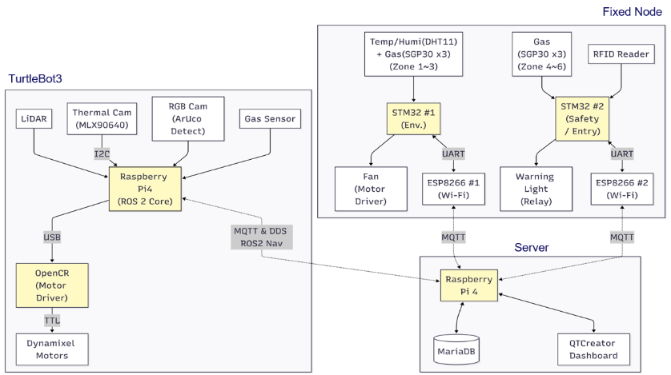
</p>
<p align="center">
  
</p>
<p align="center">
  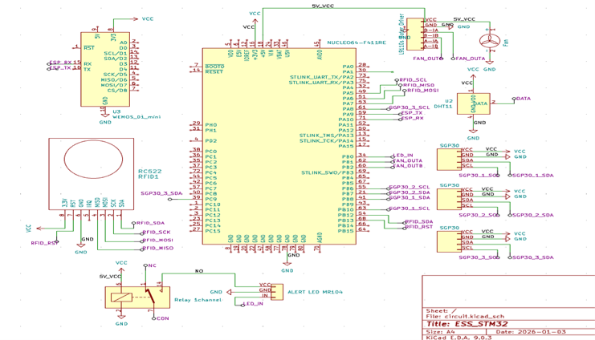
</p>

### 📍 Software Architecture
<p align="center">
  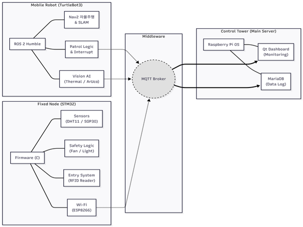
</p>

### 📍 Data Flow / Sequence
<p align="center">
  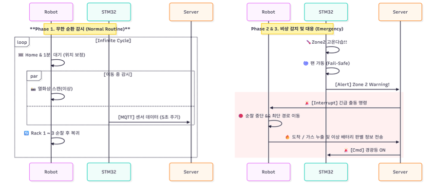
</p>

## 🤖 1-2. ROS2 Node Graph

<p align="center">
  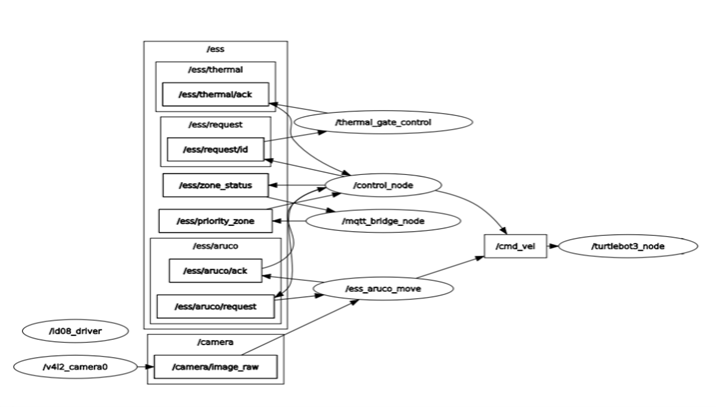
</p>
<p align="center">
  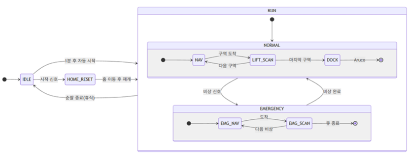
</p>

---

## 🛠️ 2. 기술 스택


<br>


<br>


<br>


---

## 🎯 3. 핵심 기능

- **지능형 환경 감시 및 자동 공조 제어**
  - **실시간 모니터링**: ESS 시설 단위의 온·습도와 구역별 가스 농도를 상시 감시
  - **자동화 제어**: 임계치 도달 시 공조기 자동 가동 및 제어 이력 데이터화
  - **제어 요청 전송**: 관제 화면 상의 버튼 입력(ON/OFF)을 MQTT 메시지로 변환하여 현장 장치에 전달

- **열화상 기반 배터리 랙 이상 탐지**
  - **발열 모니터링**: 열화상 카메라를 활용한 배터리 랙의 국부 발열 상태 감시
  - **단계별 알림**: 온도 위험도에 따라 Warning / Critical 시각적 경고 즉각 표시
  - **이력 관리**: 배터리 열 이상 이벤트를 기록하여 사고 분석 데이터 확보

- **ROS2 기반 자율 순찰 로봇**
  - **자율 순찰**: Nav2 알고리즘 기반으로 시설 내부를 주기적으로 자율 주행
  - **사각지대 해소**: 이동형 로봇을 활용해 고정형 센서가 닿지 않는 공간 감시 보완
  - **자동 복구**: ArUco 마커 기반 정밀 도킹으로 순찰 후 안정적인 복귀 수행

- **RFID 출입 보안 시스템**
  - **접근 통제**: RFID 카드 인증을 통한 ESS 시설 보안 구역 관리
  - **중앙 검증**: 서버 중심의 권한 검증을 통해 비인가자 출입 차단
  - **로그 추적**: 모든 출입 시도 및 결과(성공/실패) 이력 관리

- **중앙 집중형 통합 관제 타워 (Control Tower GUI)**
  - **통합 시각화**: 시설 전체 상태(환경, 배터리, 보안)를 단일 대시보드에서 시각화
  - **이력 분석**: 축적된 로그 데이터를 바탕으로 기간별 통계 및 필터링 조회 기능 제공

---

## 📘 4. 기술 구현

### 1) 센서 네트워크 및 공조 로직
- **데이터 수집**: DHT11 및 6개 구역별 SGP30 가스 센서를 활용한 고밀도 환경 데이터 수집
- **제어 루프**: 환경 임계치 도달 시 공조기 가동 신호를 발생시키고 제어 사유를 DB에 즉시 저장하는 로직 구현

### 2) 열화상 ROI 분석 및 이벤트 트리거
- **정밀 감지**: MLX90640 열화상 카메라를 활용하여 배터리 랙 영역(ROI) 내 최고 온도 및 발생 좌표 추출
- **단계별 로직**: 온도 기준치에 따른 이벤트 처리 시스템 구축 및 관제 UI와의 실시간 시각 알림 연동

### 3) ROS2 Nav2 및 ArUco 정밀 제어
- **경로 최적화**: Nav2 Stack을 활용한 효율적인 순찰 경로 생성 및 장애물 회피 주행
- **오차 보정**: OpenCV 기반 ArUco 마커 인식 알고리즘을 통한 도킹 스테이션 정밀 정렬 및 위치 보정

### 4) 서버 주도형 RFID 인증 구조
- **인증 요청 흐름**: STM32에서 RFID 카드 UID와 위치 정보를 서버로 전송
- **권한 검증**: 서버에서 관리자 DB(admins 테이블)와 대조하여 출입 허가 여부 판단
- **결과 회신 및 로그 기록**: 인증 결과를 STM32로 회신하고, 모든 시도 이력을 access_logs 테이블에 저장

### 5) 관제 GUI 및 데이터 파이프라인
- **동적 UI 설계**: Qt를 활용한 ESS 실시간 맵(2x3), 배터리 랙(3x3) 상태 위젯 및 공조기 애니메이션 구현
- **상태 동기화**: DB 상태에 따라 관제 UI를 자동 갱신
- **제어 요청 전송**: 관제 화면 버튼 입력 시 MQTT를 통해 현장 장치로 제어 요청 메시지 전송
- **로그 조회 로직**: 기간·이벤트 유형·위험 단계·건물 조건에 따른 조건 기반 SQL 조회로 로그 필터링 구현
  
---

## 👨‍💻 5. 역할 및 기여

- **Qt 기반 중앙 관제 UI 개발**
  - 시설 전체 상태를 한눈에 파악할 수 있는 ESS 통합 관제 대시보드 설계 및 구현
  - 배터리 랙 3×3 맵 및 구역별 환경 상태 표시를 위한 Custom Widget 구현
  - resizeEvent 핸들러 내 좌표 재계산 로직을 적용하여 화면 크기 변경 시 UI 정합성 유지

- **MariaDB 스키마 설계 및 로그 구조 정리**
  - 환경 데이터, 출입 로그, 이벤트 기록을 분리·정규화한 DB 테이블 구조 설계
  - 시간·구역·이벤트 유형을 조합한 조건 기반 중복 데이터 저장 방지 로직 적용

- **MQTT 기반 데이터 수집 및 DB 연동**
  - Python 기반 MQTT Subscriber를 구현하여 센서 및 로봇 이벤트 메시지를 수신하고 DB에 저장하는 파이프라인을 구축
  - 네트워크 지연·누락 상황을 고려한 예외 처리 로직으로 데이터 정합성 관리

- **관제 화면 기반 제어 요청 연동**
  - 관제 GUI 버튼 입력을 MQTT 메시지로 변환하여 현장 장치로 제어 요청 발행
  - QMovie 기반 애니메이션을 활용하여 공조기(Fan) 동작 상태를 직관적으로 표시하는 UI 구현

---

## 🐞 6. 트러블슈팅

### 1) 알람 종료 후 UI 상태 미복귀
- **현상**: 가스/열 이상 종료 후에도 UI 구역 색상 정상(NORMAL)로 돌아오지 않음
- **분석**: 단일 타이머 구조로 이벤트 종료 후 UI 상태를 안정적으로 동기화하기 어려움
- **해결**: SQL `DATE_SUB(NOW(), INTERVAL 10 SECOND)` 조건과 QSet 기반 Full Sweep UI 자동 복귀 로직 적용
- **결과**: UI와 알람 상태를 자동으로 정합성 있게 유지

### 2) MQTT 재접속 시 중복 데이터 적재
- **현상**: 서버 재시작 시 브로커에 남아있던 메시지가 DB에 중복 저장
- **분석**: clean_session 옵션 미설정으로 잔류 세션 데이터 발송
- **해결**: clean_session=True 적용 및 기존 DB 데이터를 조회하여 중복 시 저장하지 않도록 로직 구현
- **결과**: DB 부하 최소화, 데이터 무결성 강화

### 3) 가변 창 크기 대응 시 위젯 위치 문제
- **현상**: Qt 창 크기 조절 시 배경 위 ESS 맵 위젯 위치 어긋남
- **분석**: 절대 좌표 기반 렌더링으로 리사이징 대응 불가
- **해결**: resizeEvent에서 부모 rect() 기반 overlay->setGeometry 동적 계산
- **결과**: 다양한 화면 환경에서 반응형 UI 구현

---

## 📚 7. 배운 점

- **엔드투엔드 시스템 통합 경험**
  직접 설계한 프로토콜로 센서-DB-UI를 연결하는 아키텍처를 구현하며 STM32 센서 모듈과 ROS2 로봇에서 송신되는 이벤트 데이터를 MQTT를 통해 통합하고, MariaDB와 Qt 관제 UI까지 연결하는 전체 데이터 흐름을 경험함. 이를 통해 시스템 통합 과정 전반과 설계-구현 간 격차를 이해하는 실무적 역량을 함양함.

- **실시간 데이터 정합성 관리**
  MQTT Subscriber와 DB 연동 과정에서 네트워크 지연·재접속 상황을 고려한 예외 처리 로직 설계 경험. 알람 종료 시 UI 상태 자동 복귀와 중복 데이터 저장 방지 로직을 구현하며 데이터 무결성 확보 방안을 경험함.

- **반응형 UI 설계**
  resizeEvent 핸들러 내 좌표 재계산 로직과 Custom Widget을 활용하여, 가변 해상도 환경에서도 배터리 랙/환경 맵 UI가 왜곡 없이 표시되도록 구현. 다양한 화면 환경에서 안정적 UI 설계 경험 확보.

- **하이브리드 관제 구조 이해**
  고정형 센서와 이동형 로봇을 결합한 관제 구조를 경험하며, 사각지대를 최소화하고 이벤트 발생 시 다양한 데이터 소스를 활용해 대응하는 구조적 설계 방식을 습득함.

- **백엔드 효율화**
  제한된 하드웨어 환경에서 불필요한 DB I/O를 줄이고 의미 있는 상태 변화 데이터 위주로 선별 저장하도록 설계. 이를 통해 관제 로그의 가독성과 운영 효율성을 높이는 경험을 얻음.

---

<div align="center">
<a href="#japanese">⬇️ 日本語バージョンへ移動 (Go to Japanese Version) ⬇️</a>
</div>

</div>

---

<div id="japanese">

### 🇯🇵 Japanese Version

# 🔋 E.S.S.E.N.T.I.A.L
## ESS Safety System with Environmental Network & Thermal Intelligent ALert Logic
データ駆動型ESS統合安全監視システム：ROS2ロボット巡回とセンサーネットワークによる異常の自動検知・分析・対応

<a href="docs/assets/video/full_demo.gif">
  
</a>

---

## 💡 1. プロジェクト概要

本プロジェクトは、ESS（エネルギー貯蔵装置）施設における火災、ガス漏れ、環境変化などの異常兆候を**リアルタイムで検知し対応**する統合安全監視システムです。

STM32センサーモジュールとROS2ベースの巡回ロボットから収集されたデータをMQTT経由で集約してMariaDBに記録し、<strong>Qtベースの中央監視センター（Control Tower）</strong>でリアルタイム監視および遠隔制御要求を発行できる仕組みを構築しました。

特に、移動型ロボットと固定型センサーを組み合わせた**ハイブリッド監視アーキテクチャ**を採用することで、従来の固定型センサーのみでは解消が難しかった死角の問題を克服しました。

## 🧩 1-1. System Architecture
### 📍 Hardware Architecture
<p align="center">
  
</p>
<p align="center">
  
</p>
<p align="center">
  
</p>

### 📍 Software Architecture
<p align="center">
  
</p>

### 📍 Data Flow / Sequence
<p align="center">
  
</p>

## 🤖 1-2. ROS2 Node Graph

<p align="center">
  
</p>
<p align="center">
  
</p>

---

## 🛠️ 2. 技術スタック


<br>


<br>


<br>


---

## 🎯 3. 主要機能

- **知能型環境監視および自動空調制御**
  - **リアルタイム監視**: ESS施設単位の温湿度および区域ごとのガス濃度を常時監視
  - **自動制御**: 閾値到達時に空調を自動起動、制御履歴をデータ化
  - **制御リクエスト送信**: 監視画面上のボタン操作（ON／OFF）をMQTTメッセージとして現場装置へ送信

- **熱画像によるバッテリラック異常検知**
  - **発熱監視**: 熱画像カメラを用いたバッテリラックの局所的発熱状態監視
  - **多段階通知**: 温度危険度に応じたWarning / Criticalの視覚的警告を即座に発報
  - **履歴管理**: バッテリ熱異常イベントを記録し、事故分析用データを確保

- **ROS2ベース自律巡回ロボット**
  - **自律巡回**: Nav2アルゴリズムに基づき施設内を定期的に自律走行
  - **死角の排除**: 移動型ロボットを活用し、固定型センサーが届かない空間の監視をカバー
  - **自動復帰**: ArUcoマーカーに基づく精密ドッキングで巡回後安定的に復帰

- **RFID出入管理システム**
  - **アクセス制御**: RFIDカード認証によるESS施設セキュリティ区域管理
  - **一元認証**: サーバー側で権限を一括検証し、未認可者の入室を阻止
  - **ログ追跡**: 全ての入退室試行と結果（成功/失敗）を記録

- **中央集中型統合監視タワー（Control Tower GUI）**
  - **統合可視化**: 施設全体の状態（環境・バッテリ・セキュリティ）を単一ダッシュボードで可視化
  - **履歴分析**: 蓄積されたログデータに基づき、期間別統計やフィルタリング検索機能を提供

---

## 📘 4. 技術実装

### 1) センサーネットワークと空調制御ロジック
- **データ収集**: DHT11および6つの区域別SGP30ガスセンサーを活用して高密度環境データを収集
- **制御ループ**: 環境閾値到達時に空調起動信号を生成し、制御要因をDBに即時保存するロジックを実装

### 2) 熱画像ROI解析およびイベントトリガー
- **精密検知**: MLX90640熱画像カメラでバッテリラック領域(ROI)内の最高温度および発生座標を取得
- **多段階ロジック**: 温度基準に応じたイベント処理システムを構築し、監視UIへのリアルタイム通知連携を実現

### 3) ROS2 Nav2およびArUco精密制御
- **経路最適化**: Nav2 Stackを用いた効率的な巡回経路生成および障害物回避
- **誤差補正**: OpenCVベースのArUcoマーカー認識アルゴリズムでドッキングステーションへの精密な整列と位置補正

### 4) サーバ集中型RFID認証構造
- **認証リクエストフロー**: STM32からRFIDカードUIDと位置情報をサーバに送信
- **権限検証**: サーバ側で管理者DB(adminsテーブル)と照合し、入室の可否を判断
- **結果返却とログ記録**: 認証結果をSTM32に返送し、全試行履歴をaccess_logsテーブルに保存

### 5) 監視GUIおよびデータパイプライン
- **動的UI設計**: QtでESSリアルタイムマップ(2x3)、バッテリラック(3x3)ウィジェット、空調アニメーションを実装
- **状態同期**: DB状態変化に応じて監視UIを自動更新
- **制御リクエスト送信**: GUI上のボタン操作をMQTTメッセージとして現場装置へ送信
- **ログ検索ロジック**: 期間・イベント種別・危険度・建物条件など、多角的な条件指定によるSQL検索とフィルタリング
  
---

## 👨‍💻 5. 担当役割と貢献

- **Qtベース中央監視UI開発**
  - 施設全体の状態を即座に把握できる、視認性に優れた統合ダッシュボードの設計・実装
  - バッテリラック3x3マップおよび区域別環境状態表示用Custom Widgetを実装
  - resizeEventを活用した座標再計算ロジックにより、画面サイズ変更時も崩れない動的なUIレイアウトを実現

- **MariaDBスキーマ設計およびログ構造の最適化**
  - 環境データ、入退室ログ、イベント記録を分離・正規化したDBテーブル構造を設計
  - 時間・区域・イベント種別に基づく重複データ排除ロジックを適用し、データ品質を向上

- **MQTTベースのデータ収集およびDB連携**
  - PythonでMQTT Subscriberを実装し、センサー・ロボットイベントをDBに保存するパイプライン構築
  - ネットワーク遅延・欠落を考慮した例外処理ロジックでデータ整合性を管理

- **監視画面ベース制御リクエスト連携**
  - GUIボタン入力をMQTTメッセージに変換して現場装置に制御リクエスト送信
  - QMovieアニメーションで空調(Fan)動作状態を直感的に表示

---

## 🐞 6. トラブルシューティング

### 1) アラーム終了後のUI状態未復帰
- **現象**: ガス/熱異常終了後もUI区域色が正常(NORMAL)に戻らない
- **分析**: 単一タイマー構造により、イベント終了後のUI状態を安定的に同期することが困難
- **解決**: SQL `DATE_SUB(NOW(), INTERVAL 10 SECOND)` 条件とQSetベースFull Sweep UI自動復帰ロジックを適用
- **結果**: UIとアラーム状態を自動で整合性維持

### 2) MQTT再接続時の重複データ保存
- **現象**: サーバ再起動時、ブローカーに残っていたメッセージがDBに重複保存
- **分析**: clean_sessionオプションの未設定により、残留セッションデータが送信
- **解決**: clean_session=Trueを適用、既存DBデータを照合して重複時の保存を回避
- **結果**: DB負荷最小化、データ整合性の強化

### 3) 可変ウィンドウサイズ対応でウィジェット位置問題
- **現象**: Qtウィンドウサイズ変更時、背景上のESSマップウィジェット位置ずれ
- **分析**: 絶対座標ベースのレンダリングのため、リサイズへの対応が不可
- **解決**: resizeEventにて親のrect()を基準にoverlay->setGeometryを動的に計算
- **結果**: 多様な画面環境でレスポンシブなUI実現

---

## 📚 7. 学んだこと

- **エンドツーエンドシステム統合経験**
  独自設計プロトコルでセンサー・DB・UIを接続するアーキテクチャを実装。STM32センサーモジュールとROS2ロボットから送信されるイベントをMQTTで統合し、MariaDBおよびQt監視UIまで連携させる全データフローを構築。システム統合全般および設計・実装のギャップ理解に基づく実務能力を習得。

- **リアルタイムデータ整合性管理**
  MQTT SubscriberとDB連携時のネットワーク遅延・再接続状況を考慮した例外処理を設計。アラーム終了時のUI自動復帰や重複データ保存防止ロジックを実装し、データ整合性確保の実務的手法を経験。

- **レスポンシブUI設計**
  resizeEventでの座標再計算とCustom Widget活用により、可変解像度環境でもバッテリラックや環境マップUIを歪みなく表示。多様な画面環境で安定したUI設計の経験を確保。

- **ハイブリッド監視構造の理解**
  固定型センサーと移動型ロボットを組み合わせた監視構造を経験。死角を最小化し、イベント発生時に多様なデータソースを統合して対応する構造設計手法を習得。

- **バックエンド効率化**
  リソースの制限された環境で不要DB I/Oを削減し、有意義な状態変化データのみ保存。監視ログの可読性向上と運用効率化を実現する最適化プロセスを経験。

---

<div align="center">
<a href="#korean">⬆️ 한국어 버전으로 돌아가기 (Go back to Korean Version) ⬆️</a>
</div>

</div>

---
---

<div align="center">
<a href="#Team">⬇️ Go to Team Version ⬇️</a>
</div>

</div>

---

<div id="Team">

### ⚡ Team

# E.S.S.E.N.T.I.A.L  
**ESS Safety System with Environmental & Thermal Intelligent ALert**

> ESS 시설의 화재/가스/환경 이상을 감지하고,  
> Hybrid Patrol Robot(ROS2) + MQTT + Control Tower(서버/DB/UI)로 **즉시 알림/이력/관제**까지 이어지는 통합 안전 시스템

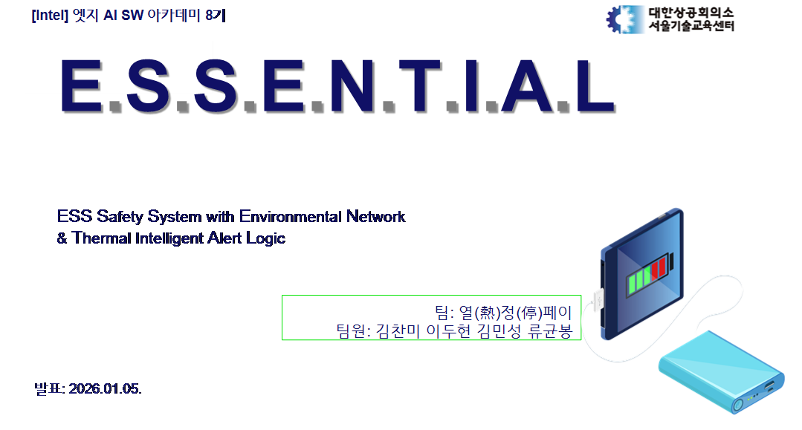

---


### Full Demo (All-in-one)
<a href="docs/assets/video/full_demo.gif">
  
</a>

### Video Clips

<table>
  <tr>
    <td align="center">
      <a href="docs/assets/video/aruco.gif">
        
      </a><br/>
      <b>ArUco Auto-Docking</b>
    </td>
    <td align="center">
      <a href="docs/assets/video/emergency.gif">
        
      </a><br/>
      <b>Emergency</b>
    </td>
    <td align="center">
      <a href="docs/assets/video/critical.gif">
        
      </a><br/>
      <b>Critical</b>
    </td>
  </tr>
  <tr>
    <td align="center">
      <a href="docs/assets/video/warning.gif">
        
      </a><br/>
      <b>Warning</b>
    </td>
    <td align="center">
      <a href="docs/assets/video/ventilation.gif">
        
      </a><br/>
      <b>Ventilation</b>
    </td>
    <td align="center">
      <a href="docs/assets/video/rfid.gif">
        
      </a><br/>
      <b>RFID</b>
    </td>
  </tr>
</table>

## Background
- ESS 시설의 주요 리스크(화재/가스/환경 변화)에 대해 **“감지 → 대응 → 확인/관제”**까지 연결된 시스템 필요
- 이 프로젝트는 Zone별 센서 데이터 수집과 로봇 순찰을 결합해, 이상 상황을 서버로 전송하고 DB 이력화 및 UI로 관제하는 것을 목표로 함

---

## Goals
- [ ] 각 Zone별 독립적 환경 데이터 수집
- [ ] MQTT 기반 초저지연 데이터 전송
- [ ] 위험 감지 시 이벤트/이력 저장 + 관제 UI 표시
- [ ] 로봇 순찰 + ArUco 기반 홈 복귀

---

## Hardware Architecture

<p align="center">
  
</p>
<p align="center">
  
</p>
<p align="center">
  
</p>

---

## Software Architecture


---

## Data Flow / Sequence


---

### ROS Nodes / Graph


## Key Features
### 1) Access Authentication & Alarm
- RFID 기반 관리자 인증
- 가스 이상 감지 시 시청각 알림 + 서버 즉각 전송(MQTT)

### 2) Environmental Monitoring & HVAC Control
- 온/습도 수집 및 임계 조건 기반 공조 제어
- 데이터는 DB 적재 + UI 조회/그래프 제공


### 3) Thermal Safety (Infrared)
- 열화상 ROI 기반 이상 픽셀 감지
- 최고온도/좌표 기반 이벤트 생성 → MQTT 전송 → DB 기록

### 4) Hybrid Patrol Robot (ROS2)
- NAV2 기반 순찰 + 구역/층 전환 로직
- ArUco 마커 기반 홈 위치 정렬(복귀 보정)

---

## MQTT Protocol (Topics)
> 서버 구독(예): `ess/env`, `ess/alert`, `ess/access/request`

### Environment
Topic: `ess/env`
```json
{"t": 23.10, "h": 55.30, "fan": "ON", "reason": "TEMP"}
```

### Alert (Gas / Thermal)
Topic: ess/alert
```text
{
  "event_type": "gas",
  "level": "warning",
  "value": 650,
  "location": "zone_1",
  "message": "Gas level elevated"
}
```

### Access Request/Response
Req Topic: ess/access/request
```text
{"admin_id":"RFID_123456","access_point":"main"}
```

Resp Topic: ess/access/response
```text
{"result":"success"}
```

### Project Structure
```text
.
├── deploy/                 # systemd/udev/scripts (로봇/라즈베리파이 자동실행)
├── ess_map/                # NAV2 map
└── src/
    ├── ess_server/         # MariaDB + MQTT subscriber + Qt UI
    ├── ess_control_pkg/    # ROS2 control node (NAV2/상태머신 등)
    ├── ess_mqtt_bridge_pkg/# ROS↔MQTT 브릿지(초안/실험 포함)
    ├── esp8266/            # ESP8266(D1 mini) MQTT bridge
    └── SGP30_3*/           # STM32 펌웨어(센서/제어)
```

### Deployment (systemd / udev)

deploy/ 폴더는 로봇(또는 Pi)에서 부팅 시 자동으로 서비스가 올라오도록 구성되어 있음.

udev: 카메라 심볼릭 링크(/dev/cam_rgb) 등

systemd:

ess-usb-camera.service : ROS2 카메라 퍼블리셔

ess-aruco-move.service : ArUco 기반 정렬/복귀 노드

ess-thermal-*.service : 열화상 체크/수집/게이트(환경에 따라 경로 조정 필요)

환경별로 /opt/ess-guardian/current/... 같은 경로는 수정이 필요할 수 있음.

### Troubleshooting (Short)

STM32 하드웨어 배선 이슈: 접점/전원/그라운드 재정리로 안정화

소프트 I2C Bit-banging 이슈: 타이밍 마진 조정 + 풀업/노이즈 대응

ROS NAV2 이슈: TF/파라미터 튜닝으로 주행 안정화

UI Update 이슈: 알림 해제 후 상태 전이 로직 보강 필요

<details>
<summary><b>Troubleshooting Screenshots</b></summary>

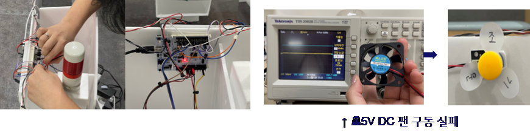
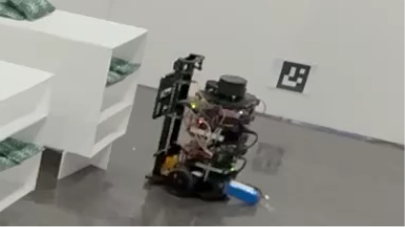
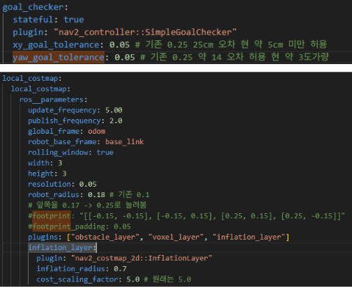
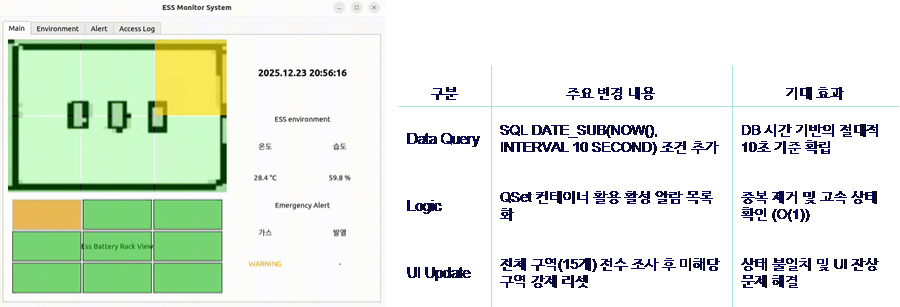

</details>

### Roadmap

이벤트 정합성(중복/쿨다운) 정책 고도화

Thermal ROI / 임계값 튜닝 자동화

Control Tower 기능 강화(필터/리포트/통계)

## 👥 Team & Roles

| Name | Role | Main Contribution (1-line) |
| :---: | :---: | :--- |
| 김찬미 (Team Leader) | STM32 / HW | 센서 수집 + 제어 로직 + 하드웨어 안정화 및 일정 리드 |
| 이두현 | ROS2 / Navigation | Nav2 기반 순찰/상태머신 및 주행 파라미터 튜닝 |
| 김민성 | Vision / Deploy | ArUco Auto-Docking + 카메라 파이프라인 + systemd/udev 자동 실행 |
| 류균봉 | Server / UI | Qt 관제 UI + MariaDB 적재 + MQTT 프로토콜/정합성 |

<details>
<summary><b>Details</b></summary>

### 김찬미 (STM32 Firmware & Hardware)
- **Firmware**: 센서(ADC/I2C) 수집 + 액추에이터(PWM) 제어 로직 구현
- **Hardware**: 배선/전원/GND/신호 품질 점검 및 통신 안정화
- 관련 코드: `src/SGP30_3*/`

### 이두현 (ROS2 Control & Navigation)
- **ROS2 Control**: 순찰 동작/상태 머신 구성
- **Navigation**: Nav2 파라미터 튜닝으로 주행 안정화
- 관련 코드: `src/ess_control_pkg/`, `ess_map/`

### 김민성 (Computer Vision & System Deploy)
- **Auto-Docking**: ArUco 기반 정렬/Homing 알고리즘(오차/hold/스케일/각도 보정) 구현
- **Vision Pipeline**: RGB/열화상 스트림 수집→이벤트 생성→전송 흐름 구성
- **Deploy**: systemd/udev로 부팅 자동 실행(카메라 심링크, 서비스 의존성, 재시작 정책)
- 관련 코드: `deploy/`, `src/ess_aruco_move/`, `src/...thermal...`

### 류균봉 (Central Server & Control UI)
- **Control Tower**: Qt(C++) 관제 대시보드/모니터링 UI 구현
- **Backend**: MariaDB 스키마/적재 및 로그 관리
- **Protocol**: MQTT 토픽/메시지 포맷 설계 및 정합성 관리
- 관련 코드: `src/ess_server/`

</details>
---

<div align="center">
<a href="#korean">⬆️ 한국어 버전으로 돌아가기 (Go back to Korean Version) ⬆️</a>
</div>
